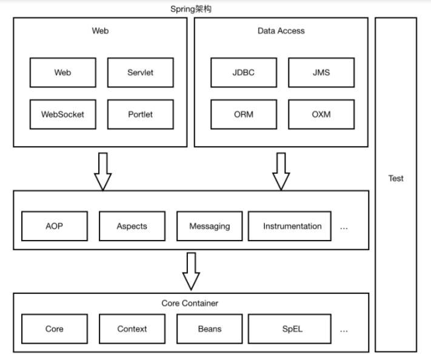
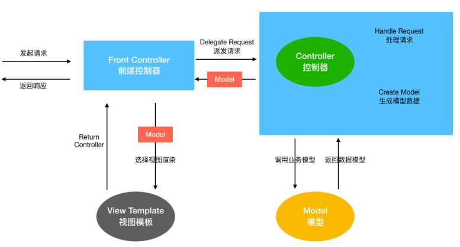
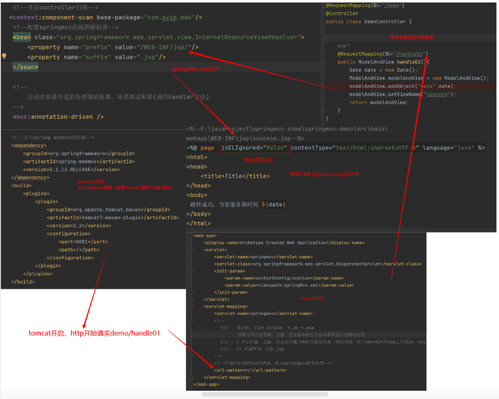
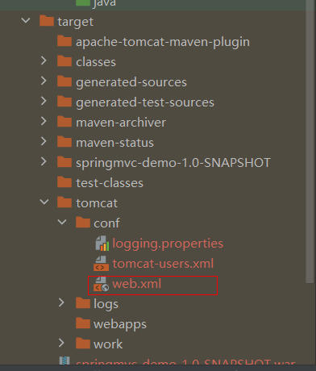
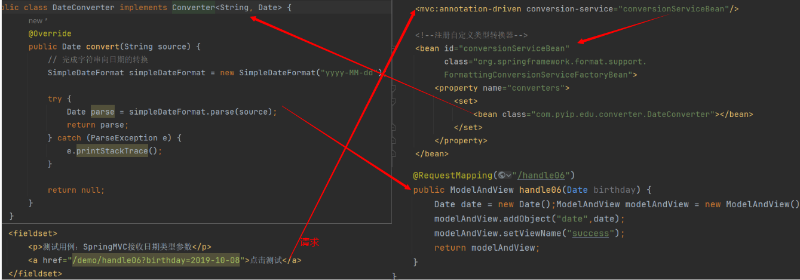
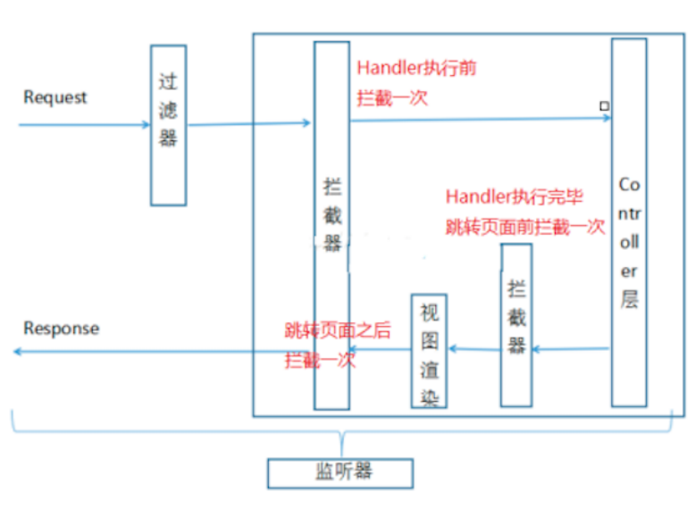
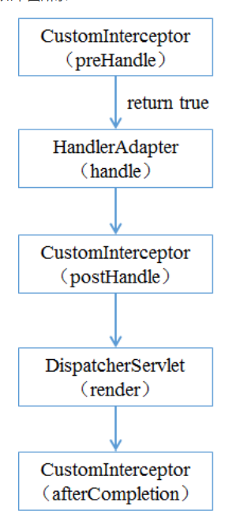
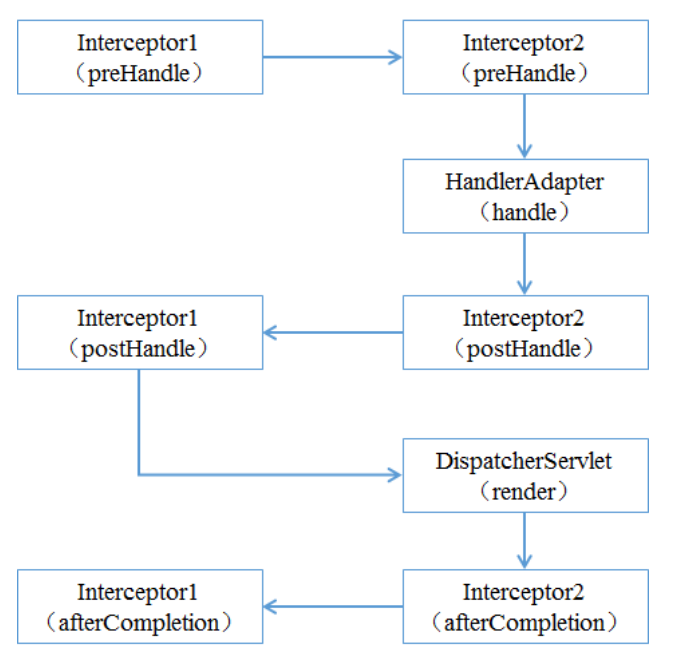

## springmvc框架学习

### 主要内容

- Spring MVC 应⽤（常规使⽤） 
- Spring MVC ⾼级技术（拦截器、异常处理器等） 
- ⼿写 MVC 框架（**⾃定义 MVC 框架**，难点/重点） 
- Spring MVC 源码深度剖析（难点/重点） 
- SSM 整合

### Spring MVC应用

#### Spring MVC简介

##### MVC体系结构

###### 三层架构

 我们的开发架构⼀般都是基于两种形式，⼀种是 C/S 架构，也就是客户端/服务器；另⼀种是 B/S 架构 ，也就是浏览器服务器。在 JavaEE 开发中，⼏乎全都是基于 B/S 架构的开发。那么在 B/S 架构中，系 统标准的三层架构包括：**表现层、业务层、持久层**。三层架构在我们的实际开发中使⽤的⾮常多，所以 我们课程中的案例也都是基于三层架构设计的。 三层架构中，每⼀层各司其职，接下来我们就说说每层都负责哪些⽅⾯： 

- 表现层 ： 

  也就是我们常说的web 层。它负责接收客户端请求，向客户端响应结果，通常客户端使⽤http 协 议请求web 层，web 需要接收 http 请求，完成 http 响应。 表现层包括展示层和控制层：控制层负责接收请求，展示层负责结果的展示。 表现层依赖业务层，接收到客户端请求⼀般会调⽤业务层进⾏业务处理，并将处理结果响应给客户端。 表现层的设计⼀般都使⽤ MVC 模型。（MVC 是表现层的设计模型，和其他层没有关系） 

- 业务层 ： 

  也就是我们常说的 service 层。它负责业务逻辑处理，和我们开发项⽬的需求息息相关。web 层依赖业 务层，但是业务层不依赖 web 层。 业务层在业务处理时可能会依赖持久层，如果要对数据持久化需要保证事务⼀致性。（也就是我们说 的， 事务应该放到业务层来控制） 

- 持久层 ：

  也就是我们是常说的 dao 层。负责数据持久化，包括数据层即数据库和数据访问层，数据库是对数据进 ⾏持久化的载体，数据访问层是业务层和持久层交互的接⼝，业务层需要通过数据访问层将数据持久化 到数据库中。通俗的讲，持久层就是和数据库交互，对数据库表进⾏增删改查的。

###### MVC设计模式

MVC 全名是 Model View Controller，是 模型(model)－视图(view)－控制器(controller) 的缩写， 是⼀ 种⽤于设计创建 Web 应⽤程序表现层的模式。MVC 中每个部分各司其职：

- Model（模型）：模型包含业务模型和数据模型，数据模型⽤于封装数据，业务模型⽤于处理业 务。

-  View（视图）： 通常指的就是我们的 jsp 或者 html。作⽤⼀般就是展示数据的。通常视图是依据 模型数据创建的。

-  Controller（控制器）： 是应⽤程序中处理⽤户交互的部分。作⽤⼀般就是处理程序逻辑的。 

  MVC提倡：每⼀层只编写⾃⼰的东⻄，不编写任何其他的代码；分层是为了解耦，解耦是为了维 护⽅便和分⼯协作。

##### Spring MVC是什么

SpringMVC 全名叫 Spring Web MVC，是⼀种基于 Java 的实现 MVC 设计模型的请求驱动类型的轻量级 Web 框架，属于 SpringFrameWork 的后续产品。

  

SpringMVC 已经成为 ⽬前最主流的 MVC 框架 之⼀，并且 随着 Spring3.0 的发布，全⾯超越 Struts2， 成为最优秀的 MVC 框架。

 servlet、struts实现接⼝、springmvc中要让**⼀个java类能够处理请求只需要添加注解**就ok

它通过⼀套注解，让⼀个简单的 Java 类成为处理请求的控制器，⽽⽆须实现任何接⼝。同时它还⽀持 RESTful 编程⻛格的请求。

 总之：Spring MVC和Struts2⼀样，都是为了解决表现层问题 的web框架，它们都是基于 MVC 设计模式的。⽽这些表现层框架的主要职责就是处理前端HTTP请求。 

Spring MVC 本质可以认为是对servlet的封装，简化了我们serlvet的开发 

作⽤：**1）接收请求 2）返回响应，跳转⻚⾯**



#### Spring Web MVC 工作流程

需求：前端浏览器请求url：http://localhost:8081/demo/handle01，

前端⻚⾯显示后台服务器的时间 开发过程

 1）配置DispatcherServlet前端控制器 

2）开发处理具体业务逻辑的Handler（@Controller、@RequestMapping）

 3）xml配置⽂件配置controller扫描，配置springmvc三⼤件 

4）将xml⽂件路径告诉springmvc（DispatcherServlet）

其需求开发的简单的内部的关系

  

##### Spring MVC请求处理流程


流程说明 

第⼀步：⽤户发送请求⾄前端控制器DispatcherServlet 

第⼆步：DispatcherServlet收到请求调⽤HandlerMapping处理器映射器

第三步：处理器映射器根据请求Url找到具体的Handler（后端控制器），⽣成处理器对象及处理器拦截 器(如果 有则⽣成)⼀并返回DispatcherServlet 

第四步：DispatcherServlet调⽤HandlerAdapter处理器适配器去调⽤Handler 

第五步：处理器适配器执⾏Handler 

第六步：Handler执⾏完成给处理器适配器返回ModelAndView 

第七步：处理器适配器向前端控制器返回 ModelAndView，ModelAndView 是SpringMVC 框架的⼀个 底层对 象，包括 Model 和 View 

第⼋步：前端控制器请求视图解析器去进⾏视图解析，根据逻辑视图名来解析真正的视图。

 第九步：视图解析器向前端控制器返回View

 第⼗步：前端控制器进⾏视图渲染，就是将模型数据（在 ModelAndView 对象中）填充到 request 域

第⼗⼀步：前端控制器向⽤户响应结果

##### Sprinb MVC九大组件

- HandlerMapping（处理器映射器） 

  > HandlerMapping 是⽤来查找 Handler 的，也就是处理器，具体的表现形式可以是类，也可以是 ⽅法。⽐如，标注了@RequestMapping的每个⽅法都可以看成是⼀个Handler。Handler负责具 体实际的请求处理，在请求到达后，HandlerMapping 的作⽤便是找到请求相应的处理器 Handler 和 Interceptor. 

- HandlerAdapter（处理器适配器）

  > HandlerAdapter 是⼀个适配器。因为 Spring MVC 中 Handler 可以是任意形式的，只要能处理请 求即可。但是把请求交给 Servlet 的时候，由于 Servlet 的⽅法结构都是 doService(HttpServletRequest req,HttpServletResponse resp)形式的，要让固定的 Servlet 处理 ⽅法调⽤ Handler 来进⾏处理，便是 HandlerAdapter 的职责。

- HandlerExceptionResolver 

  > HandlerExceptionResolver ⽤于处理 Handler 产⽣的异常情况。它的作⽤是根据异常设置 ModelAndView，之后交给渲染⽅法进⾏渲染，渲染⽅法会将 ModelAndView 渲染成⻚⾯。

-  ViewResolver 

  > ViewResolver即视图解析器，⽤于将String类型的视图名和Locale解析为View类型的视图，只有⼀ 个resolveViewName()⽅法。从⽅法的定义可以看出，Controller层返回的String类型视图名 viewName 最终会在这⾥被解析成为View。View是⽤来渲染⻚⾯的，也就是说，它会将程序返回 的参数和数据填⼊模板中，⽣成html⽂件。ViewResolver 在这个过程主要完成两件事情： ViewResolver 找到渲染所⽤的模板（第⼀件⼤事）和所⽤的技术（第⼆件⼤事，其实也就是找到 视图的类型，如JSP）并填⼊参数。默认情况下，Spring MVC会⾃动为我们配置⼀个InternalResourceViewResolver,是针对 JSP 类型视图的。

-  RequestToViewNameTranslator 

  > RequestToViewNameTranslator 组件的作⽤是从请求中获取 ViewName.因为 ViewResolver 根据 ViewName 查找 View，但有的 Handler 处理完成之后,没有设置 View，也没有设置 ViewName， 便要通过这个组件从请求中查找 ViewName。

- LocaleResolver 

  > ViewResolver 组件的 resolveViewName ⽅法需要两个参数，⼀个是视图名，⼀个是 Locale。 LocaleResolver ⽤于从请求中解析出 Locale，⽐如中国 Locale 是 zh-CN，⽤来表示⼀个区域。这 个组件也是 i18n 的基础。 

- ThemeResolver

  > ThemeResolver 组件是⽤来解析主题的。主题是样式、图⽚及它们所形成的显示效果的集合。 Spring MVC 中⼀套主题对应⼀个 properties⽂件，⾥⾯存放着与当前主题相关的所有资源，如图 ⽚、CSS样式等。创建主题⾮常简单，只需准备好资源，然后新建⼀个“主题名.properties”并将资 源设置进去，放在classpath下，之后便可以在⻚⾯中使⽤了。SpringMVC中与主题相关的类有 ThemeResolver、ThemeSource和Theme。ThemeResolver负责从请求中解析出主题名， ThemeSource根据主题名找到具体的主题，其抽象也就是Theme，可以通过Theme来获取主题和 具体的资源。

- MultipartResolver 

  > MultipartResolver ⽤于上传请求，通过将普通的请求包装成 MultipartHttpServletRequest 来实 现。MultipartHttpServletRequest 可以通过 getFile() ⽅法 直接获得⽂件。如果上传多个⽂件，还 可以调⽤ getFileMap()⽅法得到Map这样的结构，MultipartResolver 的作⽤就 是封装普通的请求，使其拥有⽂件上传的功能

- FlashMapManager 

  > FlashMap ⽤于重定向时的参数传递，⽐如在处理⽤户订单时候，为了避免重复提交，可以处理完 post请求之后重定向到⼀个get请求，这个get请求可以⽤来显示订单详情之类的信息。这样做虽然 可以规避⽤户重新提交订单的问题，但是在这个⻚⾯上要显示订单的信息，这些数据从哪⾥来获得 呢？因为重定向时么有传递参数这⼀功能的，如果不想把参数写进URL（不推荐），那么就可以通 过FlashMap来传递。只需要在重定向之前将要传递的数据写⼊请求（可以通过ServletRequestAttributes.getRequest()⽅法获得）的属性OUTPUT_FLASH_MAP_ATTRIBUTE 中，这样在重定向之后的Handler中Spring就会⾃动将其设置到Model中，在显示订单信息的⻚⾯ 上就可以直接从Model中获取数据。FlashMapManager 就是⽤来管理 FalshMap 的。

#### 静态资源拦截问题

##### 问题原因

- 在调用静态资源的时候DispatchServelet会进行拦截处理，如下

  ```xml
    <servlet-mapping>
      <servlet-name>springmvc</servlet-name>
      <!--拦截匹配规则的url请求，进入springmvc框架处理-->
      <url-pattern>/</url-pattern>
    </servlet-mapping>
  ```

- 这个拦截路径不会拦截 .jsp，但是会拦截.html等静态资源（静态资源：除了servlet和jsp之外的js、css、png等）

- 因为这个web.xml是项目的web.xml，而tomcat下的xml是全局的，优先使用项目的web.xml配置，这个web.xml下的配置覆盖了tomcat的配置

  

  tomcat的web.xml位置

  - tomcat的web.xml配置

    ```xml
        <servlet>
            <servlet-name>default</servlet-name>
            <!--默认的servlet配置 及其 映射规则 -->
            <servlet-class>org.apache.catalina.servlets.DefaultServlet</servlet-class>
            <init-param>
                <param-name>debug</param-name>
                <param-value>0</param-value>
            </init-param>
            <init-param>
                <param-name>listings</param-name>
                <param-value>false</param-value>
            </init-param>
            <load-on-startup>1</load-on-startup>
        </servlet> 
    <!-- The mapping for the default servlet -->
        <servlet-mapping>
            <servlet-name>default</servlet-name>
            <url-pattern>/</url-pattern>
        </servlet-mapping>
    
     <!-- 专门针对于jsp的Servlet的配置 及其映射规则 -->
        <servlet>
            <servlet-name>jsp</servlet-name>
            <servlet-class>org.apache.jasper.servlet.JspServlet</servlet-class>
            <init-param>
                <param-name>fork</param-name>
                <param-value>false</param-value>
            </init-param>
            <init-param>
                <param-name>xpoweredBy</param-name>
                <param-value>false</param-value>
            </init-param>
            <load-on-startup>3</load-on-startup>
        </servlet>   
    
        <!-- The mappings for the JSP servlet -->
        <servlet-mapping>
            <servlet-name>jsp</servlet-name>
            <url-pattern>*.jsp</url-pattern>
            <url-pattern>*.jspx</url-pattern>
        </servlet-mapping>
    ```

  - 我们可知，对除了.jsp的请求都会被DispatcherServlet拦截，而对于.jsp的请求由于项目的web.xml没有进行覆盖重写，所以是由tomcat进行默认处理，不进行拦截的。

##### 解决方法 

- 方法一：

  ```xml
      <!--静态资源配置，方案一-->
      <!--
          原理：添加该标签配置之后，会在SpringMVC上下文中定义一个DefaultServletHttpRequestHandler对象
               这个对象如同一个检查人员，对进入DispatcherServlet的url请求进行过滤筛查，如果发现是一个静态资源请求
               那么会把请求转由web应用服务器（tomcat）默认的DefaultServlet来处理，如果不是静态资源请求，那么继续由
               SpringMVC框架处理
      -->
      <mvc:default-servlet-handler/>
  ```

  - 缺点：

    只能对webapp下的除了WEB-INF目录下的子目录内的资源进行访问

- 方法二：

  ```xml
      <!--静态资源配置，方案二，SpringMVC框架自己处理静态资源
          mapping:约定的静态资源的url规则
          location：指定的静态资源的存放位置
      -->
      <!-- 对于请求路径/resources/xxx.html或者/js/xx.html等静态资源可以直接访问对应的location+xxx.html位置-->
      <mvc:resources location="classpath:/"  mapping="/resources/**"/>
      <mvc:resources location="/WEB-INF/js/" mapping="/js/**"/>
  ```

  能对WEB-INF，java的class类目录（包含在classpath:/中），resources目录下的内容进行访问

#### 方法接口参数

##### 为什么会这样

```java
// 原始的
    @RequestMapping("/handle01")
    public ModelAndView handle01(){
        Date date = new Date();
        ModelAndView modelAndView = new ModelAndView();
        modelAndView.addObject("date",date);
        modelAndView.setViewName("success");
        return modelAndView;
    }
/**
     * 直接声明形参ModelMap，封装数据
     * url: http://localhost:8081/demo/handle11
     * =================modelmap:class org.springframework.validation.support.BindingAwareModelMap
     */
    @RequestMapping("/handle11")
    public String handle11(ModelMap modelMap) {
        Date date = new Date();// 服务器时间
        modelMap.addAttribute("date",date);
        System.out.println("=================modelmap:" + modelMap.getClass());
        return "success";
    }
    /**
     * 直接声明形参Model，封装数据
     * url: http://localhost:8081/demo/handle12
     * =================model:class org.springframework.validation.support.BindingAwareModelMap
     */
    @RequestMapping("/handle12")
    public String handle12(Model model) {
        Date date = new Date();
        model.addAttribute("date",date);
        System.out.println("=================model:" + model.getClass());
        return "success";
    }
    /**
     * 直接声明形参Map集合，封装数据
     * url: http://localhost:8081/demo/handle13
     * =================map:class org.springframework.validation.support.BindingAwareModelMap
     */
    @RequestMapping("/handle13")
    public String handle13(Map<String,Object> map) {
        Date date = new Date();
        map.put("date",date);
        System.out.println("=================map:" + map.getClass());
        return "success";
    }
```

问题，为什么不同的形参类型都可以对数据进行封装并存储到request域中？

##### 原因

SpringMVC在handler方法上传入Map、Model和ModelMap参数，并向这些参数中保存数据（放入到请求域），都可以在页面获取到

- 它们之间是什么关系？
   运行时的具体类型都是BindingAwareModelMap，相当于给BindingAwareModelMap中保存的数据都会放在请求域中

   *  Map(jdk中的接口)   
        *  ModelMap(class,实现Map接口)
   *  Model（spring的接口）
             *              BindingAwareModelMap继承了ExtendedModelMap，ExtendedModelMap**继承了ModelMap,实现了Model接口**，是**Map和Model的共同子类**

#### 请求参数绑定

- 请求参数绑定：说⽩了SpringMVC如何接收请求参数 

  - http协议（超⽂本传输协议） 

  - 原⽣servlet接收⼀个整型参数：

    - String ageStr = request.getParameter("age");

    - Integer age = Integer.parseInt(ageStr); 

  - SpringMVC框架对Servlet的封装，简化了servlet的很多操作

  - SpringMVC在接收整型参数的时候，直接在Handler⽅法中声明形参即可 

    - @RequestMapping("xxx") 

    - public String handle(Integer age) { System.out.println(age); } 

- 参数绑定：取出参数值绑定到handler⽅法的形参上

  - 默认⽀持 Servlet API 作为⽅法参数 当需要使⽤HttpServletRequest、HttpServletResponse、HttpSession等原⽣servlet对象时，直 接在handler⽅法中形参声明使⽤即可。

    ```java
        /**
         * SpringMVC 对原生servlet api的支持  url：/demo/handle02?id=1
         * 如果要在SpringMVC中使用servlet原生对象，比如HttpServletRequest\HttpServletResponse\HttpSession，直接在Handler方法形参中声明使用即可
         */
        @RequestMapping("/handle02")
        public ModelAndView handle02(HttpServletRequest request, HttpServletResponse response, HttpSession session) {
            String id = request.getParameter("id");
            Date date = new Date();
            ModelAndView modelAndView = new ModelAndView();
            modelAndView.addObject("date",date);
            modelAndView.setViewName("success");
            return modelAndView;
        }
    ```

  - 绑定简单类型参数

    - 简单数据类型：⼋种基本数据类型及其包装类型 

    - 参数类型推荐使⽤包装数据类型，因为基础数据类型不可以为null 

      - 整型：Integer、int 
      - 字符串：String 
      - 单精度：Float、float 
      - 双精度：Double、double 
      - 布尔型：Boolean、boolean 
      - 说明：对于布尔类型的参数，请求的参数值为**true或false。或者1或0**

    - 注意：绑定简单数据类型参数，只需要直接声明形参即可（形参参数名和传递的参数名要保持⼀ 致，建议 使⽤包装类型，当形参参数名和传递参数名不⼀致时可以使⽤@RequestParam注解进⾏ ⼿动映射）

      ```java
      /*
       * SpringMVC 接收简单数据类型参数 url：/demo/handle03?ids=1
       *
       * 注意：接收简单数据类型参数，直接在handler⽅法的形参中声明即可，框架会取出参数值
      然后绑定到对应参数上
       * 要求：传递的参数名和声明的形参名称保持⼀致
       */
       @RequestMapping("/handle03")
       public ModelAndView handle03(@RequestParam("ids") Integer id,Boolean
      flag) {
       Date date = new Date();
       ModelAndView modelAndView = new ModelAndView();
       modelAndView.addObject("date",date);
       modelAndView.setViewName("success");
       return modelAndView;
       }
      ```

  - 绑定Pojo类型参数

    ```java
    /*
     * SpringMVC接收pojo类型参数 url：/demo/handle04?id=1&username=zhangsan
     *
     * 接收pojo类型参数，直接形参声明即可，类型就是Pojo的类型，形参名⽆所谓
     * 但是要求传递的参数名必须和Pojo的属性名保持⼀致
     */
     @RequestMapping("/handle04")
     public ModelAndView handle04(User user) {
     	Date date = new Date();
        ModelAndView modelAndView = new ModelAndView();
     	modelAndView.addObject("date",date);
     	modelAndView.setViewName("success");
     	return modelAndView;
     }
    ```

  - 绑定Pojo包装对象参数

    包装类型 QueryVo

    ```java
    public class QueryVo {
     	private String mail;
     	private String phone;
     	// 嵌套了另外的Pojo对象
     	private User user;
    	// getter,setter...
    }
    /*
     * SpringMVC接收pojo包装类型参数 url：/demo/handle05?
    user.id=1&user.username=zhangsan
     * 不管包装Pojo与否，它⾸先是⼀个pojo，那么就可以按照上述pojo的要求来
     * 1、绑定时候直接形参声明即可
     * 2、传参参数名和pojo属性保持⼀致，如果不能够定位数据项，那么通过属性名 + "." 的
    ⽅式进⼀步锁定数据
     *
     */
     @RequestMapping("/handle05")
     public ModelAndView handle05(QueryVo queryVo) {
     	Date date = new Date();
    	ModelAndView modelAndView = new ModelAndView();
     	modelAndView.addObject("date",date);
     	modelAndView.setViewName("success");
     	return modelAndView;
     }
    ```

  - 绑定⽇期类型参数（需要配置⾃定义类型转换器）

    - 前端jsp

      ```html
      <fieldset>
       <p>测试⽤例：SpringMVC接收⽇期类型参数</p>
       <a href="/demo/handle06?birthday=2019-10-08">点击测试</a>
      </fieldset>
      ```

    - 后台Handler方法

      ```java
      /**
       * 绑定⽇期类型参数
       * 定义⼀个SpringMVC的类型转换器 接⼝，扩展实现接⼝接⼝，注册你的实现
       * @param birthday
       * @return
       */
       @RequestMapping("/handle06")
       public ModelAndView handle06(Date birthday) {
       	Date date = new Date();ModelAndView modelAndView = new
      ModelAndView();
       	modelAndView.addObject("date",date);
       	modelAndView.setViewName("success");
       	return modelAndView;
       }
      ```

    - ⾃定义类型转换器

      ```java
      /* 
      S：source，源类型
      * T：target：⽬标类型
      */
      public class DateConverter implements Converter<String, Date> {
       @Override
       public Date convert(String source) {
       	// 完成字符串向⽇期的转换
       	SimpleDateFormat simpleDateFormat = new
      SimpleDateFormat("yyyy-MM-dd");
       	try {
       		Date parse = simpleDateFormat.parse(source);
       		return parse;
       	} catch (ParseException e) {
       		e.printStackTrace();
       	}
       	return null;
       }
      }
      ```

    - 注册⾃定义类型转换器

      ```xml
          <!--
              自动注册最合适的处理器映射器，处理器适配器(调用handler方法)
          -->
          <mvc:annotation-driven conversion-service="conversionServiceBean"/>
          <!--注册自定义类型转换器-->
          <bean id="conversionServiceBean" class="org.springframework.format.support.FormattingConversionServiceFactoryBean">
              <property name="converters">
                  <set>
                      <bean class="com.lagou.edu.converter.DateConverter"></bean>
                  </set>
              </property>
          </bean>
      ```

      

  

#### Restful风格

Restful 是⼀种 web 软件架构⻛格，它不是标准也不是协议，它倡导的是⼀个资源定位及资源操作的⻛ 格。

##### 什么是Restful

> REST（英⽂：Representational State Transfer，简称 REST）描述了⼀个架构样式的⽹络系统， ⽐如 web 应⽤程序。它⾸次出现在 2000 年 Roy Fielding 的博⼠论⽂中，他是 HTTP 规范的主要编写者之 ⼀。
>
> 在⽬前主流的三种 Web 服务交互⽅案中，REST 相⽐于 SOAP（Simple Object Access protocol， 简单对象访问协议）以及 XML-RPC 更加简单明了，⽆论是对 URL 的处理还是对 Payload 的编码， REST 都倾向于⽤更加简单轻量的⽅法设计和实现。
>
> 值得注意的是 REST 并没有⼀个明确的标准，⽽更像 是⼀种设计的⻛格。 它本身并没有什么实⽤性，其核⼼价值在于如何设计出符合 REST ⻛格的⽹络接⼝。 **资源 表现层 状态转移**

##### Restful的优点

它结构清晰、符合标准、易于理解、扩展⽅便，所以正得到越来越多⽹站的采⽤。

##### Restful的特性

- 资源（Resources）：

  >  ⽹络上的⼀个实体，或者说是⽹络上的⼀个具体信息。 它可以是⼀段⽂本、⼀张图⽚、⼀⾸歌曲、⼀种服务，总之就是⼀个具体的存在。可以⽤⼀个 URI（统 ⼀资源定位符）指向它，每种资源对应⼀个特定的 URI 。要获取这个资源，访问它的 URI 就可以，因此 URI 即为每⼀个资源的独⼀⽆⼆的识别符。 

- 表现层（Representation）：

  >  把资源具体呈现出来的形式，叫做它的表现层 （Representation）。⽐ 如，⽂本可以⽤ txt 格式表现，也可以⽤ HTML 格式、XML 格式、JSON 格式表现，甚⾄可以采⽤⼆进 制格式。 

- 状态转化（State Transfer）：

  > 每发出⼀个请求，就代表了客户端和服务器的⼀次交互过程。 HTTP 协议，是⼀个⽆状态协议，即所有的状态都保存在服务器端。因此，如果客户端想要操作服务 器， 必须通过某种⼿段，让服务器端发⽣“状态转化”（State Transfer）。⽽这种转化是建⽴在表现层 之上的，所以就是 “ 表现层状态转化” 。
  >
  > 具体说， 就是 HTTP 协议⾥⾯，四个表示操作⽅式的动词： **GET 、POST 、PUT 、DELETE** 。
  >
  > 它们分别对应四种基本操作：GET ⽤来获取资源，POST ⽤来新建资 源，PUT ⽤来更新资源，DELETE ⽤来删除资源。

##### 示例

- rest是⼀个url请求的⻛格，基于这种⻛格设计请求的url 
  - 没有rest的话，原有的url设计 http://localhost:8080/user/queryUserById.action?id=3 

​				url中定义了动作（操作），参数具体锁定到操作的是谁

- 有了rest⻛格之后	

  - rest中，认为互联⽹中的所有东⻄都是资源，既然是资源就会有⼀个唯⼀的uri标识它，代表它

  -  http://localhost:8080/user/3 代表的是id为3的那个⽤户记录（资源）

  - 锁定资源之后如何操作它呢？

    - 常规操作就是增删改查 根据请求⽅式不同，代表要做不同的操作

    -  get 查询，获取资源

    -  post 增加，新建资源

    -  put 更新

    - delete 删除资源

      rest⻛格带来的直观体现：就是传递参数⽅式的变化，参数可以在uri中了

- 示例

  - /account/1 HTTP GET ：得到 id = 1 的 account 
  - /account/1 HTTP DELETE：删除 id = 1 的 account 
  - /account/1 HTTP PUT：更新 id = 1 的 account 

- URL：资源定位符，通过URL地址去定位互联⽹中的资源（抽象的概念，⽐如图⽚、视频、app服务 等）。 

- **RESTful ⻛格 URL**：互联⽹所有的事物都是资源，要求URL中只有表示资源的名称，没有动词。 

- **RESTful⻛格资源操作**：

  > 使⽤HTTP请求中的method⽅法put、delete、post、get来操作资源。分别对 应添加、删除、修改、查询。不过⼀般使⽤时还是 post 和 get。put 和 delete⼏乎不使⽤。 

- RESTful ⻛格资源表述：

  > 可以根据需求对URL定位的资源返回不同的表述（也就是返回数据类型，⽐如 XML、JSON等数据格式）。 
  >
  > Spring MVC ⽀持 RESTful ⻛格请求，具体讲的就是使⽤ @PathVariable 注解获取 RESTful ⻛格的请求 URL中的路径变量。

##### 代码示例

- 前端 jsp页面

  ```html
  <h2>SpringMVC对Restful风格url的支持</h2>
          <fieldset>
              <p>测试用例：SpringMVC对Restful风格url的支持</p>
  
              <a href="/demo/handle/15">rest_get测试</a>
  
  
              <form method="post" action="/demo/handle">
                  <input type="text" name="username"/>
                  <input type="submit" value="提交rest_post请求"/>
              </form>
  
  
              <form method="post" action="/demo/handle/15/lisi">
                  <input type="hidden" name="_method" value="put"/>
                  <input type="submit" value="提交rest_put请求"/>
              </form>
  
  
              <form method="post" action="/demo/handle/15">
                  <input type="hidden" name="_method" value="delete"/>
                  <input type="submit" value="提交rest_delete请求"/>
              </form>
          </fieldset>
  ```

- 后台handler方法

  ```java
      @RequestMapping(value = "/handle/{id}",method = {RequestMethod.GET})
      public ModelAndView handleGet(@PathVariable("id") Integer id) {
          Date date = new Date();
          ModelAndView modelAndView = new ModelAndView();
          modelAndView.addObject("date",date);
          modelAndView.setViewName("success");
          return modelAndView;
      }
  
  
      /*
       * restful  post  /demo/handle
       */
      @RequestMapping(value = "/handle",method = {RequestMethod.POST})
      public ModelAndView handlePost(String username) {
  
          Date date = new Date();
          ModelAndView modelAndView = new ModelAndView();
          modelAndView.addObject("date",date);
          modelAndView.setViewName("success");
          return modelAndView;
      }
  
  
      /*
       * restful  put  /demo/handle/15/lisi
       */
      @RequestMapping(value = "/handle/{id}/{name}",method = {RequestMethod.PUT})
      public ModelAndView handlePut(@PathVariable("id") Integer id, @PathVariable("name") String username) {
  
          Date date = new Date();
          ModelAndView modelAndView = new ModelAndView();
          modelAndView.addObject("date",date);
          modelAndView.setViewName("success");
          return modelAndView;
      }
  
  
      /*
       * restful  delete  /demo/handle/15
       */
      @RequestMapping(value = "/handle/{id}",method = {RequestMethod.DELETE})
      public ModelAndView handleDelete(@PathVariable("id") Integer id) {
  
          Date date = new Date();
          ModelAndView modelAndView = new ModelAndView();
          modelAndView.addObject("date",date);
          modelAndView.setViewName("success");
          return modelAndView;
      }
  ```

- web.xml中配置请求⽅式过滤器（将特定的post请求转换为put和delete请求

  ```xml
   <!--springmvc提供的针对post请求的编码过滤器-->
      <filter>
          <filter-name>encoding</filter-name>
          <filter-class>org.springframework.web.filter.CharacterEncodingFilter</filter-class>
          <init-param>
              <param-name>encoding</param-name>
              <param-value>UTF-8</param-value>
          </init-param>
      </filter>
  
      <!--配置springmvc请求方式转换过滤器，会检查请求参数中是否有_method参数，如果有就按照指定的请求方式进行转换-->
      <filter>
          <filter-name>hiddenHttpMethodFilter</filter-name>
          <filter-class>org.springframework.web.filter.HiddenHttpMethodFilter</filter-class>
      </filter>
  <!--
   html请求页面的值要写为
   <input type="hidden" name="_method" value="delete"/>
  -->
  
      <filter-mapping>
          <filter-name>encoding</filter-name>
          <url-pattern>/*</url-pattern>
      </filter-mapping>
  
  
      <filter-mapping>
          <filter-name>hiddenHttpMethodFilter</filter-name>
          <url-pattern>/*</url-pattern>
      </filter-mapping>
  ```

  

#### Ajax Json交互

交互：

- 前端到后台：前端ajax发送json格式字符串，后台直接接收为pojo参数，使⽤注解@RequstBody
- 后台到前端：后台直接返回pojo对象，前端直接接收为json对象或者字符串，使⽤注解 @ResponseBody

##### 什么是Json

> Json是⼀种与语⾔⽆关的数据交互格式，就是⼀种字符串，只是⽤特殊符号{}内表示对象、[]内表示数 组、""内是属性或值、：表示后者是前者的值
>
>  {"name": "Michael"}可以理解为是⼀个包含name为Michael的对象 
>
> [{"name": "Michael"},{"name": "Jerry"}]就表示包含两个对象的数组

##### @ResponseBody注解

> @responseBody注解的作⽤是将controller的⽅法返回的对象通过适当的转换器转换为指定的格式之 后，写⼊到response对象的body区，通常⽤来返回JSON数据或者是XML数据。 
>
> 注意：在使⽤此注解之 后不会再⾛视图处理器，⽽是直接将数据写⼊到输⼊流中，他的效果等同于通过response对象输出指定 格式的数据。

##### 分析Spring MVC使用Json交互

- jar包导入

  ```xml
          <!--json数据交互所需jar，start-->
          <dependency>
              <groupId>com.fasterxml.jackson.core</groupId>
              <artifactId>jackson-core</artifactId>
              <version>2.9.0</version>
          </dependency>
          <dependency>
              <groupId>com.fasterxml.jackson.core</groupId>
              <artifactId>jackson-databind</artifactId>
              <version>2.9.0</version>
          </dependency>
          <dependency>
              <groupId>com.fasterxml.jackson.core</groupId>
              <artifactId>jackson-annotations</artifactId>
              <version>2.9.0</version>
          </dependency>
          <!--json数据交互所需jar，end-->
  ```

- 代码示例

  - 前端jsp代码及js代码

    ```html
    <div>
        <h2>Ajax json交互</h2>
        <fieldset>
            <input type="button" id="ajaxBtn" value="ajax提交"/>
        </fieldset>
    </div>
    
        <script type="text/javascript" src="/js/jquery.min.js"></script>
    
        <script>
            $(function () {
    
                $("#ajaxBtn").bind("click",function () {
                    // 发送ajax请求
                    $.ajax({
                        url: '/demo/handle07',
                        type: 'POST',
                        data: '{"id":"1","name":"李四"}',
                        contentType: 'application/json;charset=utf-8',
                        dataType: 'json',
                        success: function (data) {
                            alert(data.name);
                        }
                    })
    
                })
    
    
            })
        </script>
    ```

  - 后台Handler方法

    ```java
        @RequestMapping("/handle07")
        // 添加@ResponseBody之后，不再走视图解析器那个流程，而是等同于response直接输出数据
        public @ResponseBody User handle07(@RequestBody User user) {
            // 业务逻辑处理，修改name为张三丰
            user.setName("张三丰");
            return user;
        }
    ```

    

### Spring MVC高级技术

#### 拦截器（Inteceptor）使用

##### 监听器、过滤器和拦截器的对比

- Servlet：处理Request请求和Response响应 

- 过滤器（Filter）：对Request请求起到过滤的作⽤，作⽤在Servlet之前，如果配置为/*可以对所 有的资源访问（servlet、js/css静态资源等）进⾏过滤处理 

- 监听器（Listener）：实现了javax.servlet.ServletContextListener 接⼝的服务器端组件，它随 Web应⽤的启动⽽启动，只初始化⼀次，然后会⼀直运⾏监视，随Web应⽤的停⽌⽽销毁 

  - 作⽤⼀：做⼀些初始化⼯作，web应⽤中spring容器启动ContextLoaderListener 
  - 作⽤⼆：监听web中的特定事件，⽐如HttpSession,ServletRequest的创建和销毁；变量的创建、 销毁和修改等。可以在某些动作前后增加处理，实现监控，⽐如统计在线⼈数，利⽤ HttpSessionLisener等。 

- 拦截器（Interceptor）：是SpringMVC、Struts等表现层框架⾃⼰的，不会拦截 jsp/html/css/image的访问等，只会拦截访问的控制器⽅法（Handler）。 

  从配置的⻆度也能够总结发现：serlvet、filter、listener是配置在web.xml中的，⽽interceptor是 配置在表现层框架⾃⼰的配置⽂件中的

  - 在Handler业务逻辑执⾏之前拦截⼀次
  -  在Handler逻辑执⾏完毕但未跳转⻚⾯之前拦截⼀次
  -  在跳转⻚⾯之后拦截⼀次

​       

##### 拦截器的执行流程

在运⾏程序时，拦截器的执⾏是有⼀定顺序的，该顺序与配置⽂件中所定义的拦截器的顺序相关。 单个 拦截器，在程序中的执⾏流程如下图所示：



- 1）程序先执⾏preHandle()⽅法，如果该⽅法的返回值为true，则程序会继续向下执⾏处理器中的⽅ 法，否则将不再向下执⾏。
-  2）在业务处理器（即控制器Controller类）处理完请求后，会执⾏postHandle()⽅法，然后会通过 DispatcherServlet向客户端返回响应。 
- 3）在DispatcherServlet处理完请求后，才会执⾏afterCompletion()⽅法。

##### 多个拦截器的执行流程

多个拦截器（假设有两个拦截器Interceptor1和Interceptor2，并且在配置⽂件中， Interceptor1拦截 器配置在前），在程序中的执⾏流程如下图所示：



从图可以看出，当有多个拦截器同时⼯作时，它们的**preHandle()⽅法会按照配置⽂件中拦截器的配置 顺序执⾏，⽽它们的postHandle()⽅法和afterCompletion()⽅法则会按照配置顺序的反序执⾏**。

- 代码示例

  - ⾃定义SpringMVC拦截器

    ```java
    public class MyIntercepter01 implements HandlerInterceptor {
    
    
        /**
         * 会在handler方法业务逻辑执行之前执行
         * 往往在这里完成权限校验工作
         * @param request
         * @param response
         * @param handler
         * @return  返回值boolean代表是否放行，true代表放行，false代表中止
         * @throws Exception
         */
        @Override
        public boolean preHandle(HttpServletRequest request, HttpServletResponse response, Object handler) throws Exception {
            System.out.println("MyIntercepter01 preHandle......");
            return true;
        }
    
    
        /**
         * 会在handler方法业务逻辑执行之后尚未跳转页面时执行
         * @param request
         * @param response
         * @param handler
         * @param modelAndView  封装了视图和数据，此时尚未跳转页面呢，你可以在这里针对返回的数据和视图信息进行修改
         * @throws Exception
         */
        @Override
        public void postHandle(HttpServletRequest request, HttpServletResponse response, Object handler, ModelAndView modelAndView) throws Exception {
            System.out.println("MyIntercepter01 postHandle......");
        }
    
        /**
         * 页面已经跳转渲染完毕之后执行
         * @param request
         * @param response
         * @param handler
         * @param ex  可以在这里捕获异常
         * @throws Exception
         */
        @Override
        public void afterCompletion(HttpServletRequest request, HttpServletResponse response, Object handler, Exception ex) throws Exception {
            System.out.println("MyIntercepter01 afterCompletion......");
        }
    }
    ```

  - 注册SpringMVC拦截器

    ```xml
    <mvc:interceptors>
            <!--拦截所有handler-->
            <!--<bean class="com.pyip.edu.interceptor.MyIntercepter01"/>-->
            <mvc:interceptor>
                <!--配置当前拦截器的url拦截规则，**代表当前目录下及其子目录下的所有url-->
                <mvc:mapping path="/**"/>
                <!--exclude-mapping可以在mapping的基础上排除一些url拦截-->
                <!--<mvc:exclude-mapping path="/demo/**"/>-->
                <bean class="com.pyip.edu.interceptor.MyIntercepter01"/>
            </mvc:interceptor>
    
    
            <mvc:interceptor>
                <mvc:mapping path="/**"/>
                <bean class="com.pyip.edu.interceptor.MyIntercepter02"/>
            </mvc:interceptor>
    
        </mvc:interceptors>
    ```

#### 处理multipart形式的数据

⽂件上传 原⽣servlet处理上传的⽂件数据的，springmvc⼜是对serlvet的封装 

- 文件上传

  - 所需jar包

    ```xml
            <!--文件上传所需坐标-->
            <dependency>
                <groupId>commons-fileupload</groupId>
                <artifactId>commons-fileupload</artifactId>
                <version>1.3.1</version>
            </dependency>
    ```

  - 配置⽂件上传解析器

    ```xml
        <!--多元素解析器
            id固定为multipartResolver
        -->
        <bean id="multipartResolver" class="org.springframework.web.multipart.commons.CommonsMultipartResolver">
            <!--设置上传文件大小上限，单位是字节，-1代表没有限制也是默认的-->
            <property name="maxUploadSize" value="5000000"/>
        </bean>
    ```

  - 前端Form

    ```html
    <div>
        <h2>multipart 文件上传</h2>
        <fieldset>
            <%--
                1 method="post"
                2 enctype="multipart/form-data"
                3 type="file"
            --%>
            <form method="post" enctype="multipart/form-data" action="/demo/upload">
                <input type="file" name="uploadFile"/>
                <input type="submit" value="上传"/>
            </form>
        </fieldset>
    </div>
    ```

  - 后台接收Handler

    ```java
    /**
         * 文件上传
         * @return
         */
        @RequestMapping(value = "/upload")
        public ModelAndView upload(MultipartFile uploadFile, HttpSession session) throws IOException, IOException {
    
            // 处理上传文件
            // 重命名，原名123.jpg ，获取后缀
            String originalFilename = uploadFile.getOriginalFilename();// 原始名称
            // 扩展名  jpg
            String ext = originalFilename.substring(originalFilename.lastIndexOf(".") + 1, originalFilename.length());
            String newName = UUID.randomUUID().toString() + "." + ext;
    
            // 存储,要存储到指定的文件夹，/uploads/yyyy-MM-dd，考虑文件过多的情况按照日期，生成一个子文件夹
            String realPath = session.getServletContext().getRealPath("/uploads");
            String datePath = new SimpleDateFormat("yyyy-MM-dd").format(new Date());
            File folder = new File(realPath + "/" + datePath);
    
            if(!folder.exists()) {
                folder.mkdirs();
            }
    
    
            // 存储文件到目录
            uploadFile.transferTo(new File(folder,newName));
    
    
            // TODO 文件磁盘路径要更新到数据库字段
    
            Date date = new Date();
            ModelAndView modelAndView = new ModelAndView();
            modelAndView.addObject("date",date);
            modelAndView.setViewName("success");
            return modelAndView;
        }
    ```

#### 在控制器中处理异常

- 在hanlder的方法中添加一个除0异常

- 导入此代码

  ```java
  // 可以让我们优雅的捕获所有Controller对象handler方法抛出的异常
  @ControllerAdvice
  public class GlobalExceptionResolver {
      @ExceptionHandler(ArithmeticException.class)
      public ModelAndView handleException(ArithmeticException exception, HttpServletResponse response) {
          ModelAndView modelAndView = new ModelAndView();
          modelAndView.addObject("msg",exception.getMessage());
          modelAndView.setViewName("error");
          return modelAndView;
      }
  }
  ```

- 跳转到error.jsp页面

#### 基于Flash属性的跨重定向请求数据传递

重定向时请求参数会丢失，我们往往需要重新携带请求参数，我们可以进⾏⼿动参数拼接如下：

```java
return "redirect:handle01?name=" + name;
```

但是上述拼接参数的⽅法**属于get请求，携带参数⻓度有限制，参数安全性也不⾼**。

此时，我们可以使 ⽤SpringMVC提供的flash属性机制，向上下⽂中添加flash属性，框架会在session中记录该属性值，当 跳转到⻚⾯之后框架会⾃动删除flash属性，不需要我们⼿动删除

通过这种⽅式进⾏重定向参数传递， 参数⻓度和安全性都得到了保障，如下：

```java
    @RequestMapping("/handleRedirect")
    public String handleRedirect(String name, RedirectAttributes redirectAttributes) {

        //return "redirect:handle01?name=" + name;  // 拼接参数安全性、参数长度都有局限
        // addFlashAttribute方法设置了一个flash类型属性，该属性会被暂存到session中，在跳转到页面之后该属性销毁
        redirectAttributes.addFlashAttribute("name",name);
        return "redirect:handle01";
        //     @RequestMapping("/handle01")
        //    public ModelAndView handle01(@ModelAttribute("name") String name){
    }
```

### 手写MVC框架

